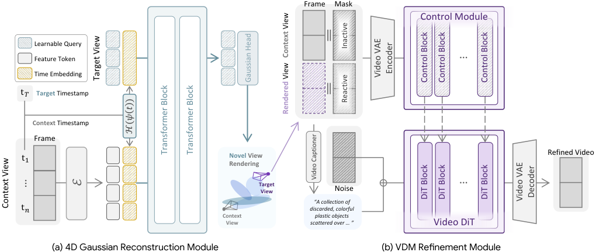

<p align="center">
  <h1 align="center">Learning Global Motion with Compact Gaussians <br> for Feed-Forward 4D Reconstruction</h1>
  <p align="center">
    <a href="">Mungyeom Kim</a><sup>1*</sup>
    ·
    <a href="https://sites.google.com/view/minjeon/home">Minkyeong Jeon</a><sup>1*</sup>
    ·
    <a href="https://hg010303.github.io/">Honggyu An</a><sup>1*</sup>
    ·
    <a href="https://crepejung00.github.io/">Jaewoo Jung</a><sup>1</sup>
    ·
    <a href="">Hyunah Ko</a><sup>1</sup>
    ·
    <a href="https://onground.github.io/">Jisang Han</a><sup>1</sup>
    ·
    <a href="">Hyeonseo Yu</a><sup>1</sup>
    ·
    <a href="">Donghwan Shin</a><sup>1</sup>
    ·
    <a href="https://sunghwanhong.github.io/">Sunghwan Hong</a><sup>2</sup>
    ·
    <a href="">Takuya Narihira</a><sup>3</sup>
    ·
    <a href="">Kazumi Fukuda</a><sup>3</sup>
    ·
    <a href="https://www.yukimitsufuji.com/">Yuki Mitsufuji</a><sup>3,4†</sup>
    ·
    <a href="https://cvlab.kaist.ac.kr/members/faculty">Seungryong Kim</a><sup>1†</sup>
  </p>
  <h4 align="center"><sup>1</sup>KAIST AI, <sup>2</sup>ETH Zurich, ETH AI Center, <sup>3</sup>SONY AI, <sup>4</sup>Sony Group Corporation</h4>

  <p align='center'><sup>*</sup>Co-first author, †Co-corresponding author</p>

  <h3 align="center"><a href="https://cvlab-kaist.github.io/C4G">Project Page</a></h3>
  <div align="center"></div>
</p>

<p align="center">
  <a href="">
    
  </a>
</p>

> We propose a feed-forward framework for dynamic monocular videos using
<b>timestamp-conditioned compact Gaussian query tokens</b>.
Our approach learns globally coherent scene motion for feed-forward 4D reconstruction
without per-scene optimization.

### What to Expect
- [x] Training code for C4G Gaussian reconstruction. <br>
- [x] VDM-based rendering enhancement module code. <br>
- [ ] Pretrained C4G weights. <br>

## Installation

Our code is developed based on PyTorch 2.2.0, CUDA 12.1, and Python 3.10.

We recommend using [conda](https://docs.anaconda.com/miniconda/) for installation:

```bash
conda create -n c4g python=3.10
conda activate c4g
bash scripts/install.sh
```

## Data Preparation

For training, we use the preprocessed [RealEstate10K](https://google.github.io/realestate10k/index.html) dataset following [pixelSplat](https://github.com/dcharatan/pixelsplat) and [MVSplat](https://github.com/donydchen/mvsplat). Set the dataset path in `config/dataset/re10k.yaml` before training.

For Spring, please refer to the [official website](https://spring-benchmark.org/).

The default paths are placeholders written as `/path/to/...`.

## Pretrained Weights

C4G initializes from the C3G Gaussian decoder checkpoint. Download `gaussian_decoder.ckpt` from the [C3G Hugging Face repository](https://huggingface.co/honggyuAn/C3G/tree/main) and place it under `pretrained_weights/gaussian_decoder.ckpt`.

C4G checkpoints to be released:

* `c4g_reconstruction.ckpt`: TBD
* `c4g_vdm_refinement.ckpt`: TBD

## Training

To train C4G, run:

```bash
bash scripts/train.sh
```

The main training config is `config/training/c4g.yaml`.

If you do not want to log to wandb, keep `wandb.mode=disabled`.

## VDM-based Rendering Enhancement Module

The optional VDM-based rendering enhancement module code is included under `submodules/DiffSynth-Studio-ref_keyframes_fixed`. This module follows VACE and uses Wan2.1-VACE-1.3B in the paper.

## Citation

```bibtex
@article{kim2026c4g,
  title={Learning Global Motion with Compact Gaussians for Feed-Forward 4D Reconstruction},
  author={Kim, Mungyeom and Jeon, Minkyeong and An, Honggyu and Jung, Jaewoo and Ko, Hyunah and Han, Jisang and Yu, Hyeonseo and Shin, Donghwan and Hong, Sunghwan and Narihira, Takuya and Fukuda, Kazumi and Mitsufuji, Yuki and Kim, Seungryong},
  journal={arXiv preprint},
  year={2026}
}
```

## Acknowledgement

We thank the authors of [VGGT](https://github.com/facebookresearch/vggt), [MoGe](https://github.com/microsoft/MoGe), and [CoWTracker](https://github.com/facebookresearch/cowtracker) for their excellent work and code.
